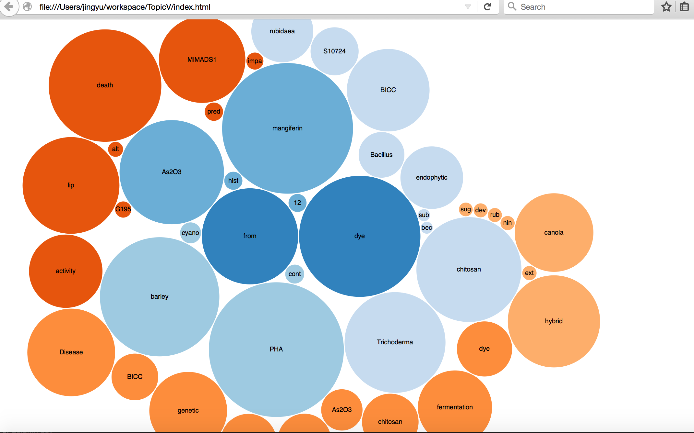
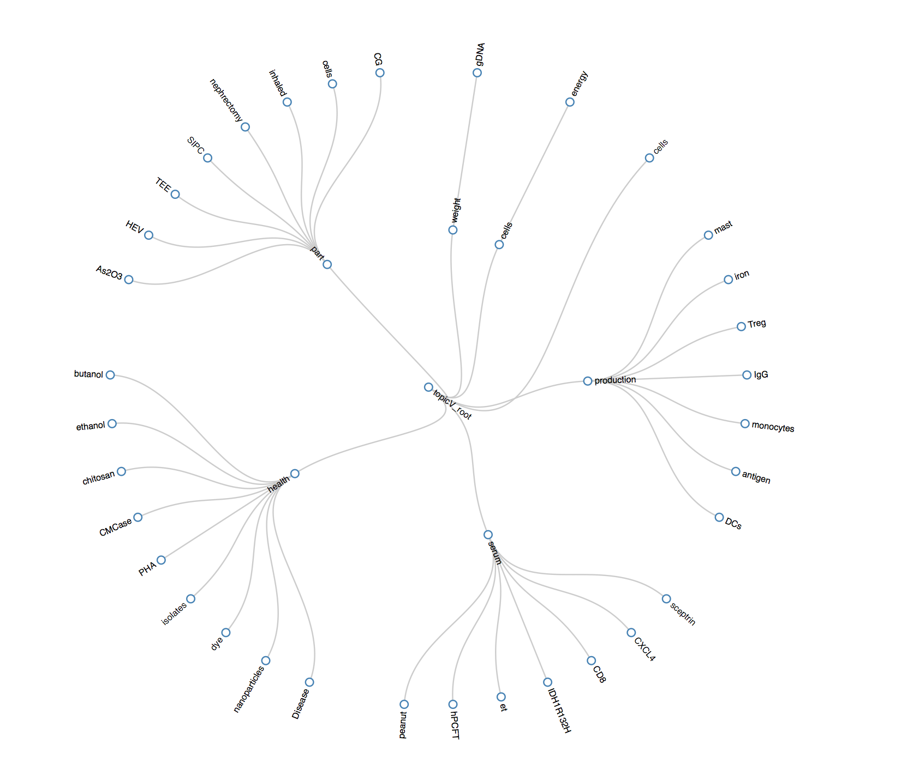
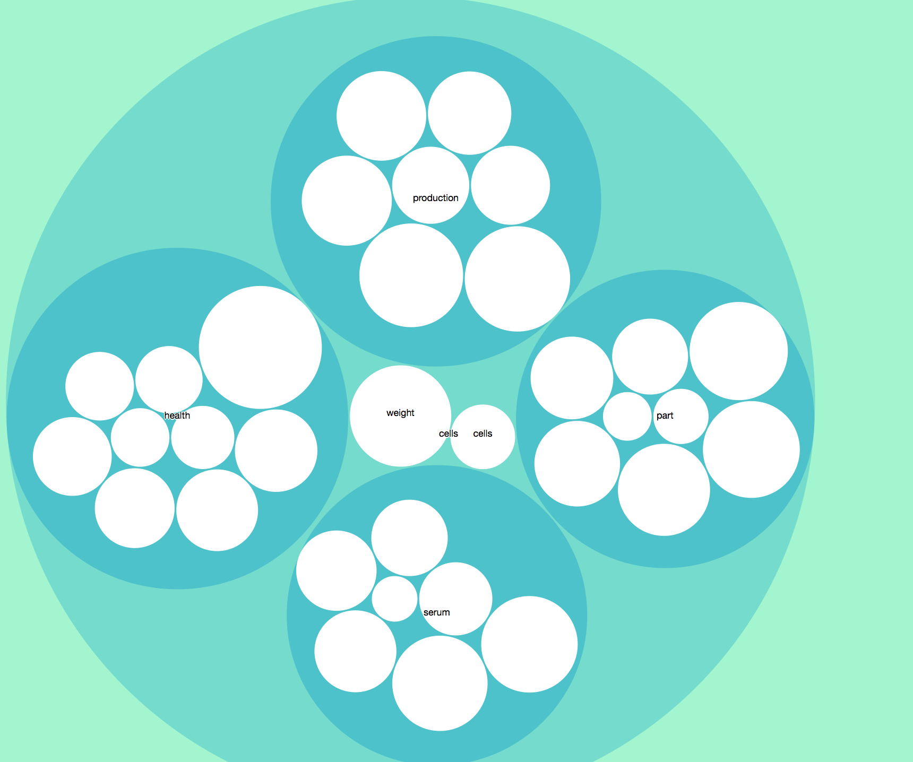
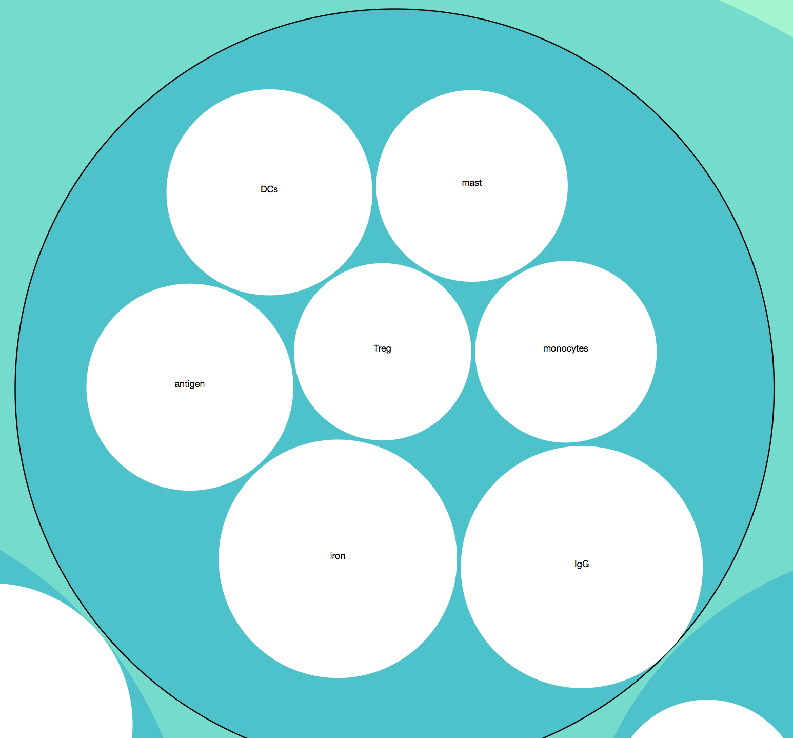

# Pubmed Central Topic Visualization
Name : Jing Yu
Andrew ID: jingyu 

## Project Topic 

We could use classification to extract hierarchical topic from files.  I get it to general json format and genrate flare.json to genral  json. Using 3D.js tachonologies to show different format of data visulazation. 

## Data Source 

TXT version data setfrom:

ftp://ftp.ncbi.nlm.nih.gov/pub/pmc/articles.txt.0-9A-B.tar.gz

ftp://ftp.ncbi.nlm.nih.gov/pub/pmc/articles.txt.C-H.tar.gz

ftp://ftp.ncbi.nlm.nih.gov/pub/pmc/articles.txt.I-N.tar.gz

ftp://ftp.ncbi.nlm.nih.gov/pub/pmc/articles.txt.O-Z.tar.gz


## Methods In General 

I attempted two methods, TF-IDF  and LDA two level 

## Method  One - TF-IDF

    * Using TF-IDF we can get a 

            |  word1     |  word2    |  word3    |   word4 ... 
Document 1: |  tf-idf1.1 | tf-idf1.2 | tf-idf1.3 |   tf-idf1. 4    
Document 2: |  tf-idf2.1 | tf-idf2.2 | tf-idf2.3 |   tf-idf2. 4    
Document 3: |  tf-idf3.1 | tf-idf3.2 | tf-idf3.3 |   tf-idf3. 4    
Document 4: |  tf-idf4.1 | tf-idf4.2 | tf-idf4.3 |   tf-idf4. 4    
Document 5: |  tf-idf5.1 | tf-idf5.2 | tf-idf5.3 |   tf-idf5. 4    

...

So for each words showing on the files we have several vector that containing tf-idf for it.  Then, we can use k-means to get the topics of it. 

For example, we ahve ten topics now . Then the advanced requirement: 
for the second level, we can gather which files are for topic 1, topic 2, etc. Then we use k-means again for them, to get the 2-level hierarchy.  

    * Disdavantage of TF-IDF for topic extracting: 
 Just focus on the occurence,  pay little attention to the relationship between other words.  The topic is not accurate and reasonable to some extend. 

## Method  Two  - LDA  (Used in this project)

    * Why I use LDA package 

Reason : LDA takes the relationship to words around other words into consideration, the feaure and topic extracting is more reasonable. 

The package is : LDA4j:https://github.com/hankcs/LDA4j 

The project is based on this package and my modification. 

    * LDA in big picture
Latent Dirichlet allocation (LDA) is a generative model that allows sets of observations to be explained by unobserved groups that explain why some parts of the data are similar. For example, if observations are words collected into documents, it posits that each document is a mixture of a small number of topics and that each word's creation is attributable to one of the document's topics.  
We usually use mark in plate notion to represent the process: 

α is the parameter of the Dirichlet prior on the per-document topic distributions,

β is the parameter of the Dirichlet prior on the per-topic word distribution,

θ_i is the topic distribution for document i,

z_{ij} is the topic for the jth word in document i, and

w_{ij} is the specific word.

In this project, we need take the advantage of this θ to filter documents for next level topics. The detail explaination is in next section. 

    * LDA used in this project: 

LDA  can give us the topic from different files.  I took the most important one as the topic this time.  This part I use package. 

Furthermore, I also modified the package, I get the θ  from it. θ  is a matrix can give us the information where which documents , the probability of the documents belonging to the topic. We pick up the high probability doucments in this topic referring θ , and use LDA again the get the 2nd level topics. 

Please refer to the next part for more detailed explaination : 

####  Obtain θ

* Reason to obtain θ vector  and transformation

  To use LDA get the next level topic, we need select which documents havehigh coefficiency with certain topic.  θ  contains the doc-topic  information, I transform the group to topic-doc mapping and give it a threshold
  ```java
    /**
     *  Obtain theta group and convert them to topic-> doc, to show the coefficiency on the document on that topic 
     *  Using boolean type and set threshold to determine use the document for the topic or not。 
     *  Can adjust the value of threshold to control how many docs to be involved in the next level topics
     */
    public static boolean[][] convertTheta(double[][] theta){
        int docLen = theta.length; 
        int topicNum = theta[0].length;
        boolean[][] docThetaCoeff = new boolean[topicNum][docLen];
        
        for(int i = 0; i < docLen; i++){
            for(int j = 0; j < topicNum; j++){
                docThetaCoeff[j][i] = theta[i][j] > THETA_THRES_HOLD ? true: false;
            }
         }
         return docThetaCoeff;
     }

  ```
  
#### Fist Level Topics
1. Load corpus from disk 
2. Create a LDA sampler
3. Train the data using LDA model 
4. Get the phi which have topic

```java
        // 1. Load corpus from disk
        Corpus corpus = Corpus.load(folderpath);
        
        // 2. Create a LDA sampler
        LdaGibbsSampler ldaGibbsSampler = new LdaGibbsSampler(corpus.getDocument(), corpus.getVocabularySize());
        
        // 3. Train it
        ldaGibbsSampler.gibbs(TOPICNUM);
        
        // 4. The phi matrix is a LDA model, you can use LdaUtil to explain it.
        double[][] phi = ldaGibbsSampler.getPhi();
        Map<String, Double>[] topicMap = LdaUtil.translate(phi, corpus.getVocabulary(), TOPICNUM);
        LdaUtil.explain(topicMap); 
```

#### First Level Result (Sample)
topic - probability matrix : 

topic 0 :
death=0.003448130684946495
hydrolysate=0.0028500710119595536
shehatae=0.002513304305630616
BICC=0.002365809317117195
hemicellulosic=0.0022004158428108127
ethanol=0.002072251846170905
conserved=0.0019754916881347707
bagasse=0.0019208376077061392
violaceum=0.0019009705152386266
xylose=0.001805661760387883

topic 1 :
NPK=0.004612762701276974
PSB=0.002016774523095308
MiMADS1=0.001965079974284372
MADS-box=0.0017479893229713087
contaminated=0.001533856772298399
affiliation=0.001497424723562019
clones=0.0014262974132524596
clone=0.001215302389324554
library=0.0010535463858321562
non-contaminated=0.0010492813874469014

....

#### Sub Topics

     * The use θ in the next level topics 
Get the relative documents to the topic in the next level
I loop over the new θ add the fliter in the documents generating just have True mark on the sub topics : 

     * Sub level θ result after filtering by threshold
Theta : 
No [0] topic  high coefficiency docs are : false true true true true true true true true true true true true true true true true true true true true true true true true true true true true true true true true true true true true true true true true true true true true true true true true true true 
No [1] topic  high coefficiency docs are : false false false false false false false false true false false true false true false true false true false false true false false false false true false false false false false false false false false false false false false false false false false false false false false false false false false 

True means high coefficiency with the topic , and can be selected to the next level. False can not .

    * Filter the corpus for next level

```java
if(!topicThetaCoeff[i]) continue;
```
    
    * Train and store sub topics
Train method is also LDA , but on the documents relative to the upper level topics.  Using List<Object> to store the data because this format is efficient used in converting json. 

```java
for(Map<String, Double> map : topicMap){
        Map.Entry<String, Double> entry = map.entrySet().iterator().next();
        String name = entry.getKey();
        // Fliter the dirty data and empty words
        if(!isDirty(name) || set.contains(name)) continue;
        
        // Add the current level node to the list 
        SLNode slnode = new SLNode(name, (int)(entry.getValue() * MUL));
        curLevelList.add(slnode);
     } 
     // Attach the list to corresponding upper level topic
     topicLevelList.get(topicIndex).setChildren(curLevelList);
```


    * Conclusion
Uisng  LDA for the hierarchical topics because LDA are more reasonable on relationship with other words not only on occurence like TF-IDF. Using θ to filter out hte documents for next level topics. 

#### Visualization

      * Format transformation 

1. Using Gson to convert the List<Object> to flat json. 
2. Manually to trnasform the flat json to flare json used in javascript by implementing java. 

Why I not using javascript to transform ? That is because java is more efficient and do not need I/O twice if print the falt json out to disk. 

     * Size definition 
I use the MUL * probability of the words as their sizes.  Using this can efficiently showing their importance among other smame level topics

     * Showing Three Charts
1. Bubble chart 



2. Cluster chart 



3. Zoomble chart



Click it !



Different feature showing in different charts fremwork. 


#### Advantages of my training method  and visulazation

    1. Can used in generating many level hierarchical topics with small change. 

    2. LDA pays attention to the relationship among current topics  and other words, it is more reasonable over than TF-IDF in this point. 

    3. Considered about the empty words like "the, of , are ..." , filter out them, to make the result more accurate and meaningful.

    4. Considered about the charset decode type , "UTF-8" and tried others. 

    5. Filtered out other dirty words.  

    6. Using Gson and java to converting data to avoid twice I/O, enhance the efficiency. 


#### Need improvement for my methods  and visulazation

    1. To obatin the html chat result must open with firefox brower, need to set up server to run it if want open it with any brower.  
    Because  XMLHttpRequest cannot load flare.json. Cross origin requests are only supported for HTTP.    That is because the other brower cannot fetch local data in function d3.json () excepting firefox.

    2.  Limited using pre knowledge for user input word , need imporve to handle with any input

## Error analysis    

    1.  The dataset it self 
The noise of the data,  it may contain items info which can  not match the model. We need to filter them. 
    
    2. More accurate featues and pre-knowledge need to be used

LDA are base on pre knowledge of the model, we may need more classificatied pre knowledge to train our model to get more accurate topic in different levels.
    
    3. Corner Cases: 
   (1) Some topics do not have sub topics 
   (2) Same topics may belong to different upper topics
  
## Future work

1. Can prepare more accurate pre knowledge for my LDA adn this project
2. Explore  more featues for determinng topics 
3. We can try more machine learning method like TF-IDF to make comparsion

## Pacakge Used and reason

1. LDA4j : Reason stated before in section II .
2. D3.js  using in visulazation , three type charts show.
3. Gson : For converting to json format efficiently

## Reference 

http://jsfiddle.net/9FqKS/

http://coolshell.cn/articles/8422.html

http://bl.ocks.org/mbostock/4063269


